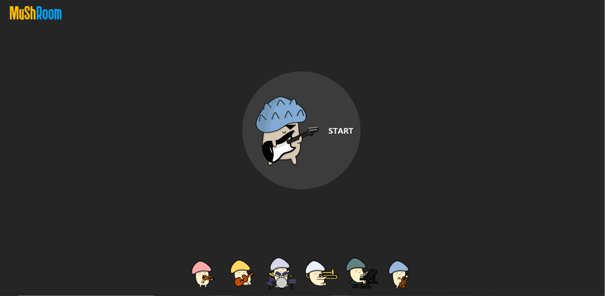
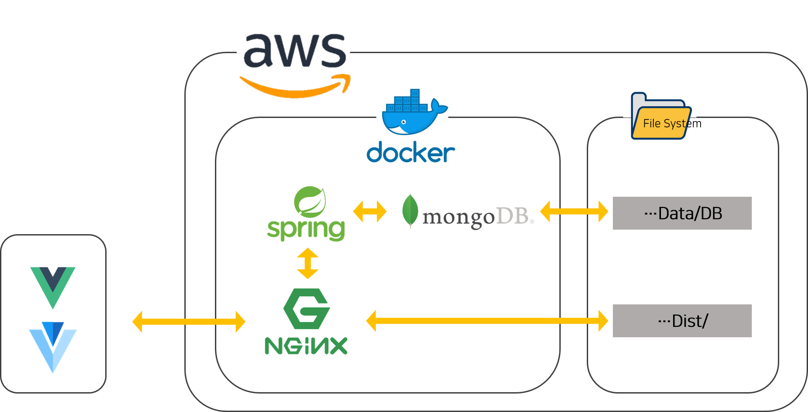
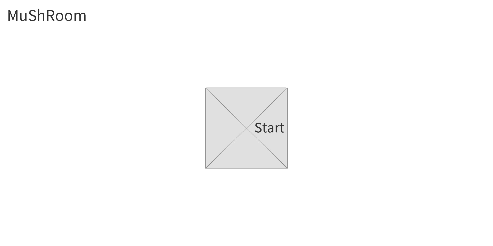
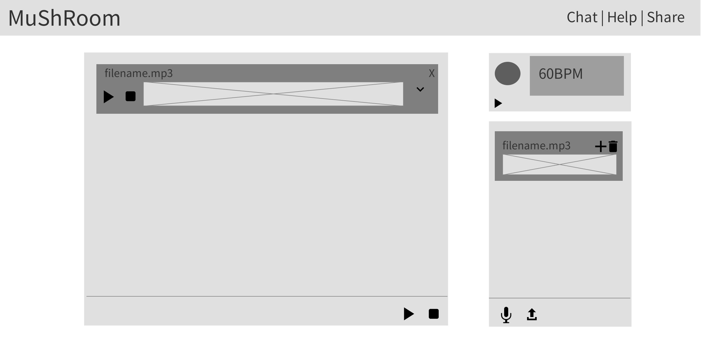
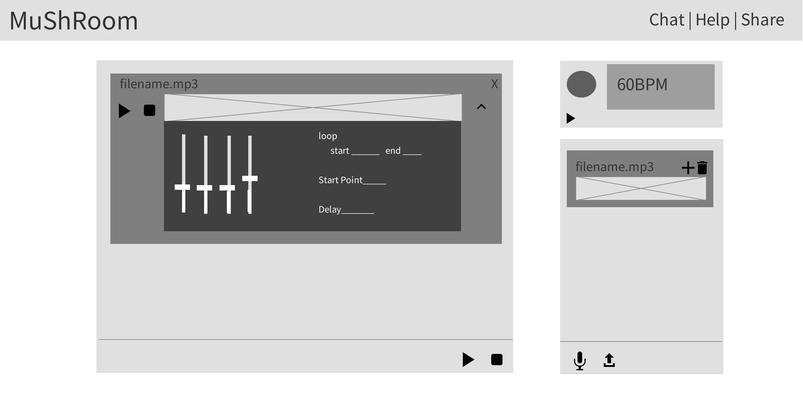

<h1 align=center>A105 - MuShRoom</h1>

<div align=center>
    
    
    
    
    
    
    
</div>


<h3 align=center><a href="document/DEMO.md">DEMO 바로가기</a></h3>
<h3 align=center><a href="https://youtu.be/tgc0P9LF5UU">UCC 바로가기</a></h3>

<div align=center>
  	Musician 링크에서 다른 사용자들과 함께 다양한 멜로디를 추가하고, 이펙트를 주어 완성도 높은 음악을 만들 수 있습니다.<br>
    실시간 채팅으로 의견을 공유하고 완성된 결과물은 Audience 링크로 공유해 사람들에게 들려주면서,<br>
    음악으로 하나되는 순간을 경험해보세요
</div>


## :book: 목차

### 🎶 [프로젝트 소개](#프로젝트-소개)

### :gear: [음악 공유 준비 과정](#음악-공유-준비-과정)

- 시스템 구성도
- 와이어프레임

### :package: [음악 공유 수단](#음악-공유-수단)​

* Frontend / Backend의 사용 Package
* 코드 실행 방법

### 🎻🎸🥁📯🎹 [크루원 소개](#크루원-소개)


## 프로젝트 소개

> **Music Share Room**
>
> 몸은 떨어져 있어도 음악으로 하나되는 우리

코로나로 인한 비대면 상황에서도

다른 사람들과 실시간으로 다양한 멜로디를 쌓아서

완성도 높은 음악을 만들고, 공유해보세요!


## 음악 공유 준비 과정
### 시스템 구성도




### 와이어프레임






## 음악 공유 수단

### Frontend 구성 요소

|    Vue 라이브러리   | Version | Comment                                              |
| :-----------------: | :-----: | :--------------------------------------------------- |
|       axios         | 0.21.1  | 서버로 요청을 보내기 위해 사용                       |
|    vue-router       | 3.5.1   | 요청 URL에 따라 브라우저에서 돔을 변경               |
|        vuex         | 3.6.2   | 상태 관리를 위해 사용                                |
|    sockjs-client    | 1.5.0   | 소켓을 구축하기 위한 라이브러리                      |
|   webstomp-client   | 1.2.6   | 소켓을 구축하기 위한 라이브러리                      |
|         tone        | 14.7.77 | 음악을 재생/편집하기 위한 라이브러리                 |
|     vue-cookies     | 1.7.4   | 접속 기록을 저장하기 위한 라이브러리                 |
| vue-toastification  | 1.7.11  | 추가, 수정, 삭제 등의 알림을 위한 라이브러리         |
|        vuetify      | 2.4.3   | UI 구성을 위해 사용                                  |
|   vue-wave-surfer   | 1.0.1   | 파형을 나타내기 위한 라이브러리                      |

### Backend 구성 요소

|   기술 스택    |   Version   | Comment                                    |
| :------------: | :---------: | :----------------------------------------- |
|    OpenJDK     |      11     | Java                                       |
|   SpringBoot   |    2.4.2    | Rest API 웹 애플리케이션 개발              |
|     Maven      |    4.0.0    | 프로젝트를 빌드하고 라이브러리를 관리 도구 |
|    MongoDB     |    4.4.3    | DB                                         |
|      JPA       |    2.1.2    | 서버와 DB의 연동을 위해 사용               |
|     Ubuntu     | 20.04.2 LTS | 서비스 제공을 위해 리눅스 서버 구축        |
|     Docker     |   20.10.2   | 컨테이너화 된 애플리케이션 관리            |
|     Nginx      |   1.19.6    | Vue 클라이언트 웹 서버 사용                |

|  Spring 라이브러리  |  Version   | Comment                      |
| :-----------------: | :--------: | :--------------------------- |
|     Spring Web      |     -      |      Rest API 서버 구축      |
|     WebSocket       |     -      |       소켓 서버 구축         |
| Spring Data MongoDB |     -      |        MongoDB 연결          |
|   Spring Data JPA   |     -      |      DB와의 연결 관리        |
|       Lombok        |     -      | Getter, Setter 등 빠른 구현  |


## 코드 실행 방법
### 선행 작업
- 프로젝트는 Java 11 버전에서 테스트 진행
- Node.js / NPM 설치
- Docker 설치
- Clone Repository
```bash
git clone https://lab.ssafy.com/s04-webmobile1-sub3/s04p13a105.git
cd s04p13a105
```

### 설치
- Docker 네트워크 생성
```bash
docker network create my-net
```
Docker의 defalt bridge는 컨테이너간 자동 DNS resolution을 제공하지 않기 때문에,  
Custom bridge를 생성한다.  
  
- 데이터베이스 설치, 실행
```bash
docker run --name mongo-db -d --network my-net mongo
```
필요할 경우 /data/db 경로(실제 데이터 저장 경로)를 외부 경로에 바인딩한다.
  
- 프론트엔드 설정 파일 생성
```javascript
// frontend/src/store/Config.js
class Config {
    static ServerURL = "http://localhost:8080" // Backend Server URL
    static HostURL = "http://localhost" // Share에서 보여주는 URL 
}

export default Config
```
  
- 프론트엔드 빌드
```bash
cd s04p13a105/frontend
  
npm run build
```

- Nginx 실행 (frontend)
```
docker run -p 80:80 -p 443:443 --network my-net -v /<Vue dist 디렉토리>:/home -v /etc/letsencrypt/:/etc/letsencrypt/ --name frontend nginx/frontend
```
위의 예시는 SSL 설정이 되어있는 nginx.conf 파일을 필요로 한다.  
필요할 경우 nginx.conf 파일 수정하여 Dockerfile 생성  
  
- nginx.conf 예시
```
user       nginx;  ## Default: nobody
worker_processes  auto;  ## Default: 1
pid        /var/run/nginx.pid;
worker_rlimit_nofile 8192;

events {
  worker_connections  4096;  ## Default: 1024
}

http {
  include    /etc/nginx/mime.types;
  include    /etc/nginx/proxy.conf;
  include    /etc/nginx/fastcgi.conf;

  default_type application/octet-stream;
  access_log   /var/log/nginx/access.log;
  error_log  /var/log/nginx/error.log;
  sendfile     on;
  tcp_nopush   on;

  server {
    listen       80;
    server_name  musicshareroom.tk www.musicshareroom.tk;
    root         /home;
    index        index.html;

    location / {
      return 301 https://$server_name$request_uri;
    }
  }

  server {
    listen       80;
    server_name  i4a105.p.ssafy.io;

    location / {
      return 301 $scheme://musicshareroom.tk$request_uri;
    }
  }

  server {
    listen       443 ssl;
    server_name  musicshareroom.tk www.musicshareroom.tk;
    root         /home;
    index        index.html;

    ssl_certificate /etc/letsencrypt/live/musicshareroom.tk/fullchain.pem;
    ssl_certificate_key /etc/letsencrypt/live/musicshareroom.tk/privkey.pem;

    location / {
      try_files $uri $uri/ /index.html;
    }

    location /api/ {
        proxy_pass http://backend:8080/;
        proxy_http_version 1.1;
        proxy_set_header Upgrade $http_upgrade;
        proxy_set_header Connection "upgrade";
        proxy_set_header Host $host;
        add_header 'Access-Control-Allow-Origin' '*';
    }
  }
}
```

- 백엔드 Dockerfile 작성
```
FROM openjdk:11
EXPOSE 8080
WORKDIR /home
ADD application.jar . 
# VOLUME /home # 홈 경로에있는 application.jar를 실행한다.
ENTRYPOINT ["java", "-jar", "application.jar"]
```

- 백엔드 빌드, 실행
```bash
cd s04p13a105/backend
  
./mvnw package
  
cp target/*.jar <Dockerfile 경로>/application.jar
cd <Dockerfile 경로>
  
docker build -t spring/backend .
docker run --network my-net -v <특정 경로>/files/:/home/files/  --name backend spring/backend
```
컨테이너의 /home/files 경로에는 실제 음악 파일이 저장되기 때문에 볼륨을 바인드한다.  

## 크루원 소개

### 🎻🎸🥁📯🎹 브레멘 음악대 팀

* **정수림** - *PM, backend*- [smill5059](https://lab.ssafy.com/smill5059)
* **권연욱** - *frontend* - [w00k0805](https://lab.ssafy.com/w00k0805)
* **송건호** - *frontend* - [gunho817](https://lab.ssafy.com/gunho817)
* **이건우** - *frontend* - [geonwoo0223](https://lab.ssafy.com/geonwoo0223)
* **이병희** - *backend* - [milk1543](https://lab.ssafy.com/milk1543)
* **정지환** - *backend* - [lee33843](https://lab.ssafy.com/kkiu1756)


### :star: Git Branch 전략

### branch

```bash
(master) -> (develop) -> (feature/frontend(backend)/feature명)
```

* master : 배포 가능한 상태로 유지
* develop : 개발용 최상위 branch
* fetaure : 기능별 branch

### commit

```bash
Commit 메시지는 행위: 설명, 내용은 파일명: 상세 작업 내용으로 구성
    예시]
        Modify : MusicBoard.vue
        - frontend/src/components/MusicBoard.vue : 재생 버튼 수정
        Feat : README.md
```

### merge

```bash
merge 하기 전에 현재 작업 진행 상황 공유
merge 권한은 모두가 가지고 있지만 같은 팀의 다른 사람에게 리뷰 신청 후 merge 하기
merge 후 불필요한 branch 지우기
```