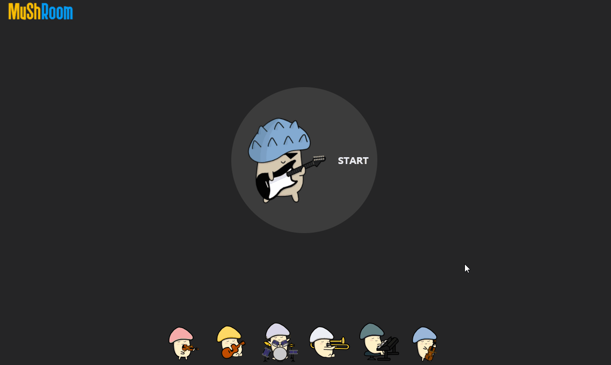
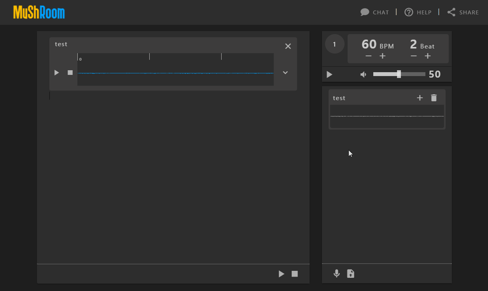
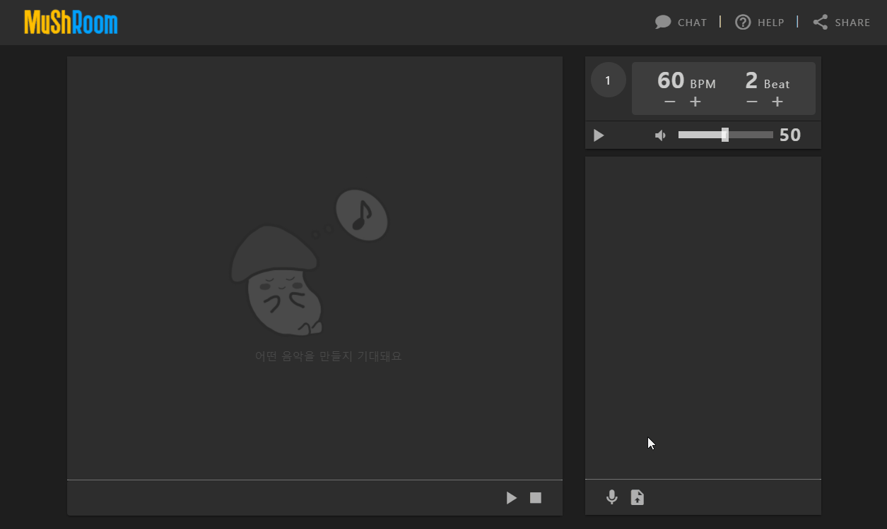
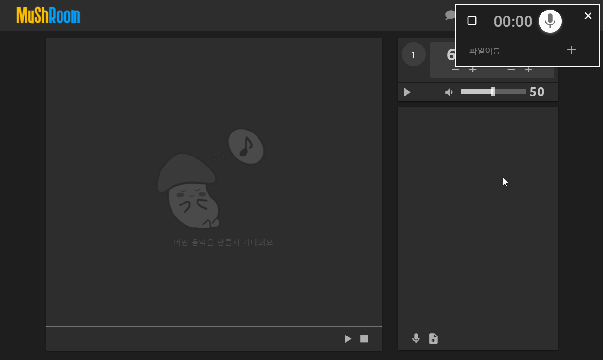
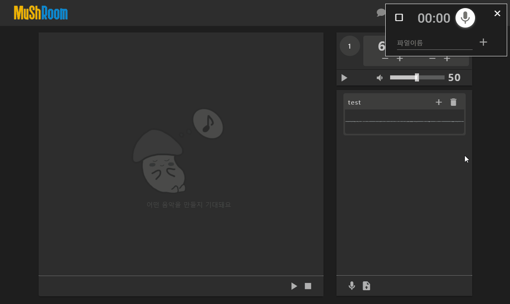
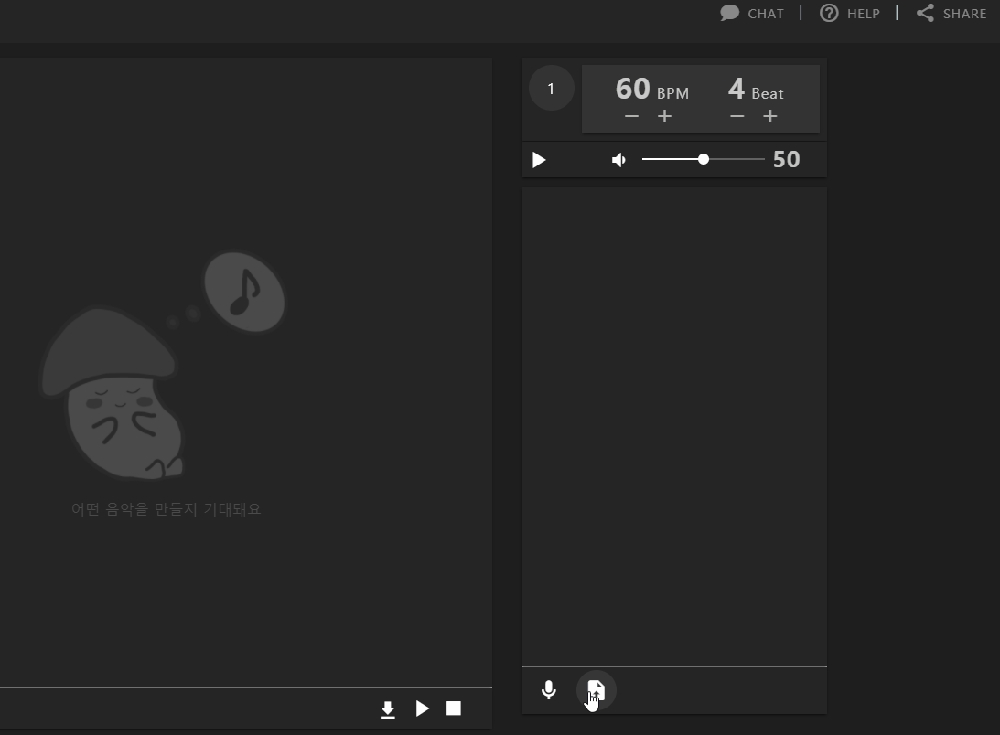
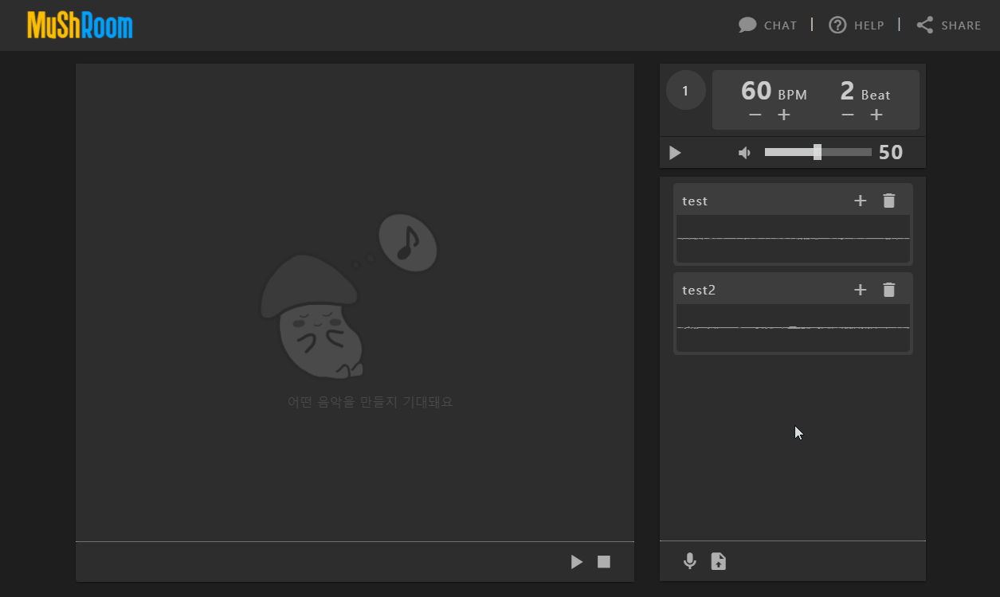
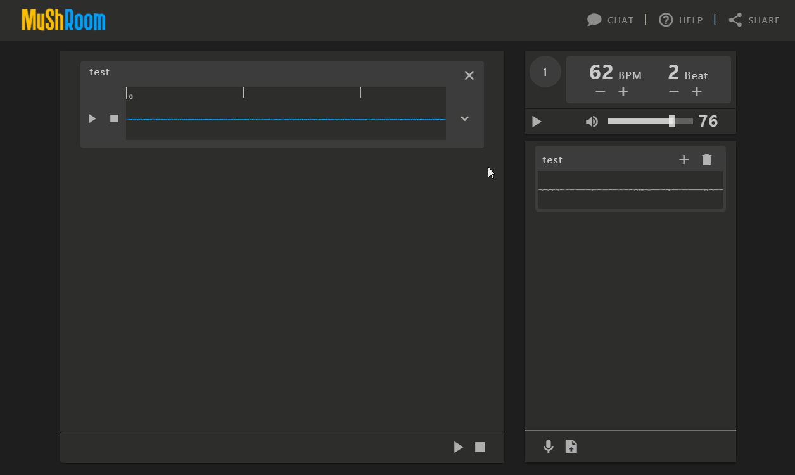
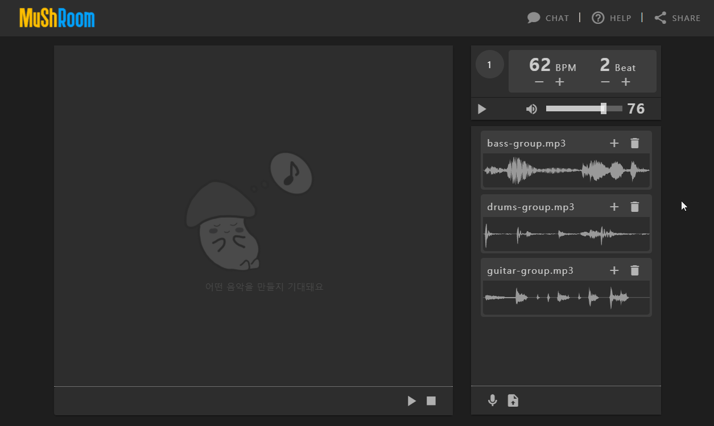

<h1 align=center>MuShRoom</h1>

> Mush Room의 메인 페이지 입니다.

## :book: 목차

### 1. [메인 페이지](#메인-페이지)

### 2. [메트로놈](#메트로놈)

### 3. [파일보드](#파일보드)

### 4. [뮤직보드](#뮤직보드)

### 5. [채팅](#채팅)

### 6. [공유하기](#공유하기)

## 메인 페이지

> MuShRoom 메인 페이지입니다.

메인 페이지에서는 새로운 방을 시작할 수 있습니다.

## 메트로놈

> 메트로놈 페이지 입니다.

###  BPM & Beat

* 메트로놈에서 BPM을 올려 속도를 높이고 Beat로 박자를 변경할 수 있습니다.
꾹 누르면 빠른 조절이 가능합니다.

## 파일보드

> 파일을 관리하는 컴포넌트 입니다.

### 1. 메트로놈과 함께 녹음

* 메트로놈 아이콘이 활성화 되어있으면 한마디 쉬고 녹음이 시작됩니다.
* 이어폰을 착용하지 않으면 메트로놈 소리가 함께 녹음될 수 있습니다.

### 2. 메트로놈 없이 녹음

* 아이콘을 눌러 메트로놈을 해제하고 녹음이 가능합니다.
* 녹음이 완료되면 파일보드(오른쪽)에 추가할 수 있습니다.

### 3. 로컬에서 추가하기

* 파일보드(오른쪽)에 직접 음악파일을 업로드 할 수 있습니다.

## 뮤직보드

> 음악을 함께 만드는 공간입니다
>

### 1. 관리

* 파일보드(오른쪽)에서 뮤직보드(왼쪽)으로 음악파일을 추가하거나 삭제가 가능합니다.

### 2. 확장

* 버튼을 눌러 확장된 화면에서 다양한 옵션을 줄 수 있습니다. 

## 채팅

> 다른 유저와 의견을 주고 받으며 음악을 함께 만들어 나갑니다.

## 공유하기

> Musician(편집 가능) 링크를 공유해 함께 음악을 만들고,
> Audience(감상 전용) 링크를 공유해 내 음악을 함께 들을 수 있습니다.
> <주의> Musician 링크는 항상 안전한 곳에 저장하십시오.

